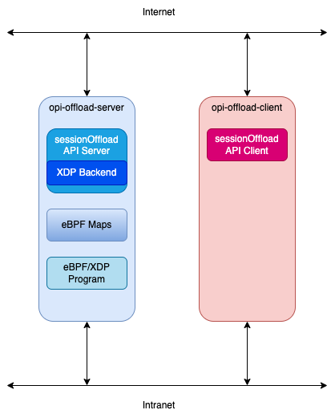

# Golang sessionOffload Bridge

This directory contains the code for the OPI sessionOffload bridge server. It
also contains an example client, and an XDP implementation of the
sessionOffload APIs.

The server by default runs in a mode where it keeps a local database of
sessions. You can run it with the `-simulate` option to enable a thread
which will simulate updating those sessions. Alternatively, you can run
it with the `-backend` option to enable the XDP backend.

The `-backend` option is meant to allow for a full testing situation of
the API, whereas the `-simulate` option is meant to allow for simulation
of the server with an appropriate client.
